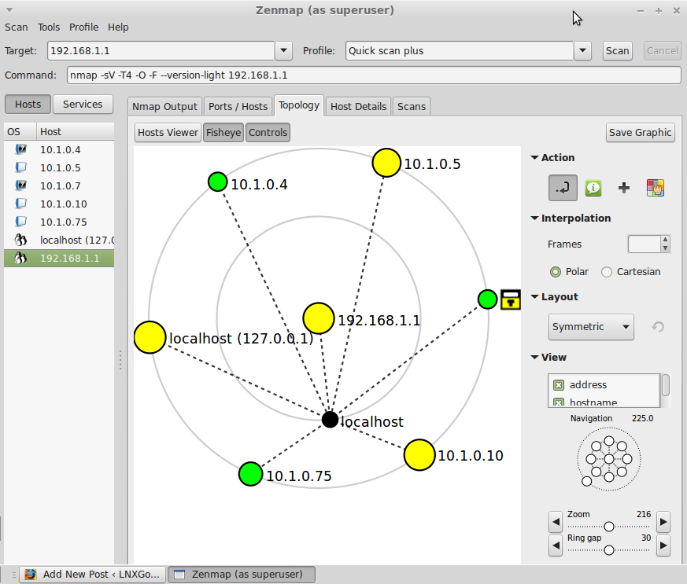

# Scanning networks overview

- Process of obtaining additional information about hosts, ports and services in network
- More detailed reconnaissance
- Purpose is to identify vulnerabilities in communication channels and then create an attack plan.
- Different techniques are used to identify hosts, ports, and services in the target network.
- Used by administrators to verify security policies, monitoring uptime etc.
- Can craft custom packets using different tools
  - E.g. [Colasoft Packet Builder](http://www.colasoft.com), [NetScanTools Pro](https://www.netscantools.com), [Packeth](http://packeth.sourceforge.net)

## Scanning types

- **Port scanning**: to list open ports and services
- **Network scanning**: to list IP addresses
- **Vulnerability scanning**: to discover the presence of known vulnerabilities

## Scanning in IPv6 Networks

- IP supports more addresses
  - Bigger search space
  - More difficult and complex than IPv4
  - Harder to do ping sweeps
- Supports large number of hosts in a subnet.
  - Probing takes longer time
- 💡 Attacker should find addresses from logs, e-mails, traffics etc. to identify addresses.

## Common ports to scan

- 📝 List of TCP and UDP port numbers

  | Port | Protocol | Service |
  | ---- |:--------:| ------- |
  | 21 | TCP | [FTP (File Transfer Protocol)](./../15-cryptography/encrypting-communication.md#ftp-file-transfer-protocol) |
  | 22 | TCP | [SSH (Secure Shell)](./../15-cryptography/tunneling-protocols.md#ssh-secure-shell) |
  | 23 | TCP | [Telnet](banner-grabbing.md#telnet) |
  | 25 | TCP | [SMTP (Simple Mail Transfer Protocol)](./../04-enumaration/enumeration-overview.md#smtp) |
  | 53 | TCP/UDP | [DNS (Domain Name Server)](./../04-enumaration/dns-enumeration.md#dns) |
  | 80 | TCP | HTTP (Hypertext Transfer Protocol) ❗ HTTP/3 will run over UDP |
  | 123 | TCP | [NTP (Network Time Protocol)](./../04-enumaration/enumeration-overview.md#ntp) |
  | 443 | TCP/UDP | HTTPS | Hypertext Transfer Protocol Secure (HTTPS) |
  | 500 | TCP/UDP | [IKE/IPSec (Internet Key Exchange / IPSec)](./../15-cryptography/tunneling-protocols.md#ipsec) |
  | 631 | TCP/UDP | IPP (Internet Printing Protocol) |
  | 3389 | TCP/UDP | RDP (Remote Desktop Protocol) |
  | 9100 | TCP/UDP | AppSocket/JetDirect (HP JetDirect, Printer PDL Data Stream) |

- Read more on [IANA ports list](https://www.iana.org/assignments/service-names-port-numbers/service-names-port-numbers.txt)
- See also • [Port monitoring | Malware analysis](./../07-malware/malware-analysis.md#port-monitoring) • [Common ports and services to enumerate | Enumeration](./../04-enumaration/enumeration-overview.md#common-ports-and-services-to-enumerate)

## Drawing and mapping out network topologies

- Useful for identifying and understanding the topology of the target network.
  - The diagram can tell the attacker how firewalls, IDSs, routers, and other devices are arranged in the network
- Information can be used for vulnerability discovery and exploit.
- A popular tool is *`zenmap`*: A GUI for [`nmap`](./scanning-tools.md#nmap)
  - 
- E.g. scanning network in a coffee shop. Run `ipconfig` (windows) to get private IP address and subnet range. Then you can scan and create a map.
