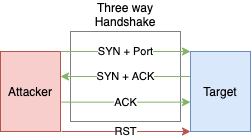
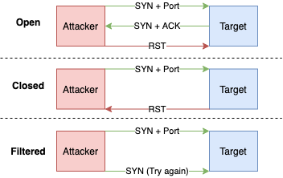

# Scanning techniques

- Used to identify open ports.

## Techniques per protocol

### Scanning ICMP

- Also called **ping scan** or **ICMP scan**
- Typically used for checking if a host is alive or has errors
- 💡 📝 It saves time before running a port scan
- ❗ Often incoming ICMP requests are disabled by firewalls.
- On Network Layer 3, so does not have port abstraction like TCP/UDP (Transport layer 4)
- In Nmap, ping commands start with `-P*` e.g. `-PE` for `ICMP Echo`
- **Round-trip time**
  - Time it takes for a packet to make a complete trip
- If blocked, usually returns no response or sometimes ICMP errors such as type 3 code 13 (destination unreachable: communication administratively prohibited)

#### Broadcast ICMP ping

- Sends packet to every possible address on the network
- E.g. `ping -b 192.168.135.255` (subnet broadcast)
  - Pings to `192.168.129.19`, `192.168.129.20`, `192.168.129.21`...
  - Or all broadcast through `ping -b 192.168.129.255`
    - Alive hosts will populate local arp table, can be seen using `arp -a`
- Usually discarded and a useless method
- See also [Smurf attack | Denial of Service](./../13-web-applications/denial-of-service.md#smurf-attack)

#### ICMP ping packet types

- **Echo**
  - Sends `ICMP ECHO` (type 8) expecting `ICMP ECHO` reply
  - Also known as ***ICMP echo scanning***
  - 📝 **Tools**
    - Nmap: `-PE`
    - hping: `hping3 -1 <target>`
- **Timestamp**
  - Sends `ICMP TIMESTAMP` (type 13)
  - **Tools**
    - Nmap: `-PP`
    - hping: `hping3 -1 <target> --icmptype 13`
- **Address mask**
  - Sends `ICMP ADDRESS MASK` (type 17)
  - Tools
    - Nmap: `-PM`
    - hping: `hping3 -1 <target> --icmptype 17`

#### Ping sweep

- Also called **ICMP sweep** or **ICMP echo scanning**
- 📝 Used to determine active hosts in target network range.
- Tools include
  - [Angry ip](https://angryip.org/)
  - [Nmap](https://Nmap.org/book/host-discovery-techniques.html): `nmap -sn 192.168.0.*`
    - or `nmap -sn <ip-address>/<subnet-range>`
    - or `nmap -sn 192.168.0.1-30` to scan e.g. between `1-30` in last octet
    - `-sn`: (optional) skip port scan

### Scanning TCP

#### TCP connect

- Also known as ***full open scan***
- Used for detecting open ports upon the completion of the three-way handshake.
- Works by establishing a full connection and then dropping it by sending a RST packet.
  - 
- **Pros**
  - 📝 Accurate, most reliable
  - Requires no additional user privileges
  - Allows scanning behind a firewall.
- **Cons**
  - 📝 Easily detectable by IDSes and logged
- 💡 Use [SYN](#syn-scanning) which would be faster and stealthier
- Tools
  - [Nmap](https://Nmap.org/book/scan-methods-connect-scan.html): `nmap -sT <ip-or-host>`

#### SYN scanning

- 📝 Also known as ***TCP SYN ping***, ***SYN stealth***, ***stealth scan***, ***half-open scan*** or ***TCP ping*** scan
- Default and most popular scan
- Works by resetting the TCP connection before the three-way handshake is completed, which in turn makes the connection half open.
  - 
- **Pros**
  - Fast
  - Reliable
  - Works on any compliant TCP stack
  - Stealthy because it never completes TCP connections (can bypass firewalls and logging)
- **Cons**
  - Require root privileges
  - Rulesets block many SYN scan attempts
- Tools
  - 📝 [Nmap](https://Nmap.org/book/synscan.html): `-PS` (host discovery) or `-sS` (port scan)
  - Hping: `hping3 -8 <port-list e.g. 50-60> –S <ip-address> –V`

#### RFC 793 scans

- 📝 According to [RFC 793](https://www.rfc-editor.org/rfc/rfc793.txt), any packet not containing `SYN`, `RST`, or `ACK` bits will result in
  - `RST` if the port is closed
  - no response the port is open
- Works by sending TCP probe packets with or without `SYN`, `RST`, `ACK` flags.
- **Pros**
  - Very stealthy (more than [SYN](#syn-scanning)) against IDS and logging systems
  - Avoids TCP three-way handshake
- **Cons**
  - Require root privileges
  - Unreliable (false positives) against systems does not follow the RFC
    - Unix-only
    - Ineffective against Windows and many IBM/Cisco devices
- 🤗 Using Nmap, one could utilize `--scanflags` to test with permutations of each case (total: 8) to check for `RST` response, but there are easier ways for most popular combinations: • [XMAS](#xmas-scan) • [NULL scan](#null-scan) • [FIN scan](#fin-scan)

##### XMAS Scan

- 📝 Works by sending a TCP frame with `FIN`, `URG`, and `PUSH` flags set.
- 🤗 **Christmas tree packet**: packet with every option set, like bulbs on a Christmas tree
- [XMAS scan response interpretation](img/xmas-scan.png)
- Tools
  - Hping: `hping3 -F -P -U <ip-address> -p <port-number>`
    - `-F` for `FIN`, `-P` for `PUSH`), `-U` for `URG`
  - 📝 [Nmap](https://Nmap.org/book/scan-methods-null-fin-xmas-scan.html): `-sX`'

##### Inverse TCP flag scan

- An inverse TCP scan has `PSH` or `URG` or `FIN` or none flag set, i.e. a single flag or no flag.
- As opposed to [XMAS](#xmas-scan) that sets `PSH` and `URG` and `FIN`, i.e. all three flags at once

###### NULL Scan

- Also known as ***NULL probe***
- Does not set any bits (TCP flag header is 0)
- [Nmap](https://Nmap.org/book/scan-methods-null-fin-xmas-scan.html): `-sN`

###### FIN Scan

- Also known as ***FIN probe***
- Sets just the TCP FIN bit.
- [Nmap](https://Nmap.org/book/scan-methods-null-fin-xmas-scan.html): `-sF`

#### ACK scanning

- Also known as ***ACK flag scanning***, ***ACK flag probe scanning*** or ***TCP ACK scan***
- Used to detect existence of firewalls, cannot detect open ports
- Works by sending TCP packet with `ACK` flag set.
  - `ACK` (acknowledgment) is used to acknowledge the successful receipt of a packet
  - 
- **Pros**
  - Difficult to log, avoids IDS detection
  - Helps detecting existence of stateful firewalls
    - As they would not allow `ACK` without `SYN`, see [TCP sessions](./tcpip-basics.md#tcpip-sessions)
- **Disadvantages**
  - Relies on BSD network code bug in older versions
  - Slow
- **Tools**
  - [Nmap](https://Nmap.org/book/scan-methods-ack-scan.html): `-PA` (host discovery) or `-sA` (port scan)
  - Hping: `hping3 –A <ip-address> –p <port>`

##### ACK Classification

- Two fields are inspected to classify `RST` response: `WINDOW` and `TTL`
- **`TTL`**
  - It's open if TTL has less than `64` while others have higher values

    ```txt
      packet 1: host X.X.X.X port 20: F:RST -> ttl: 70 win: 0 => closed
      packet 2: host X.X.X.X port 21: F:RST -> ttl: 70 win: 0 => closed
      packet 3: host X.X.X.X port 22: F:RST -> ttl: 40 win: 0 => open
      packet 4: host X.X.X.X port 23: F:RST -> ttl: 70 win: 0 => closed
    ```

- **`WINDOW`**
  - It's open if it has non-zero value.
  - Works for older BSD and UNIX but has been patched

  ```txt
    packet 1: host X.X.X.X port 20: F:RST -> ttl: 64 win: 0 => closed
    packet 2: host X.X.X.X port 21: F:RST -> ttl: 64 win: 0 => closed
    packet 3: host X.X.X.X port 22: F:RST -> ttl: 64 win: 512 => open
    packet 4: host X.X.X.X port 23: F:RST -> ttl: 64 win: 0 => closed
  ```

#### IDLE scan

- Also known as ***TCP Idle Scan***, ***IDLE header scan***, ***header scan***, ***IDLE/IPID scan***
- Allows for blind port scanning (without sending any packet with own IP)
- Utilizes IP address of a zombie machine through spoofed packets
- 🤗 Found by author of [hping2](./scanning-tools.md#hping) tool
- 📝 Flow
  1. Probe the zombie's IP ID and record it.
     - **IP ID**
       - Every IP packet on the Internet has a fragment identification number
       - Incremented by OSes for each packet sent
     - Zombie should be
       - idle as no other traffic would increase the traffic
       - assigning IP ID packets incrementally on global level instead of per-host basis.
  2. Forge a `SYN` packet from the zombie and send it to the desired port on the target.
  3. Probe the zombie's IP ID again.
     - If it's increased compared to one in step 1, port is open (it has received)
- **Pros**
  - Ultimate stealth scan as attackers IP would not be revealed
  - Can be used for framing as IDS will report zombie as the attacker
- **Cons**  
  - It takes far longer
  - Many ISPs implement egress filtering to prevent the packet spoofing
- **Tools**
  - [Nmap](https://Nmap.org/book/idlescan.html): `nmap -Pn -sI <zombie-ip/domain> <target-ip/domain>`
    - 📝 `-sI`: Idle scan
    - `-Pn`: no ping to be stealthy

### Scanning UDP

- Connectionless stream protocol, so no handshakes
- UDP is used by e.g. DNS (port 53), SNMP (port 161/162), and DHCP (port 67/68)

#### UDP Scanning

- Also known as ***UDP ping***, ***UDP/ICMP error scan*** or ***UDP ICMP_PORT_UNREACHABLE scan***
- Exploits UDP behavior where the receiver sends an ICMP packet with error code when a port is unreachable.
- No response is interpreted as "open" or "filtered" behind firewall
- **Pros**
  - Avoids TCP IDS
  - Scans non-TCP ports that are quite common
- **Cons**
  - Provides port information only
  - ICMP is rate-limited by Linux kernel however not by Windows
  - Require root privileges
  - Slower and more difficult than TCP
- **Tools**
  - Hping: `hping3 -2 <ip-address> –p <port>`
  - 📝 [Nmap](https://Nmap.org/book/scan-methods-udp-scan.html): : `-PU` (host discovery) or `-sU` (port scan)

## Other techniques

### List Scanning

- Performing a reverse DNS resolution to identify the names of the hosts.
- No packets are sent to hosts
- **Pros**
  - Sanity check to ensure that target IP addresses are proper
  - Stealthy, unobtrusive, does not trigger IDS alerts
- Tools
  - [Nmap](https://Nmap.org/book/host-discovery-controls.html): `nmap -sL <ip-address>`

### SSDP Scanning

- Used to detect UPnP vulnerabilities and carry out buffer overflow or DoS attacks
- **SSDP**
  - Simple Service Discovery Protocol
  - Network protocol based on for discovery of devices on same network
  - Basis of UPnP (Universal Plug and Play) protocol
- Steps:
  1. Attacker discovers networked devices and create a list of all the devices that respond.
  2. Attacker creates a UDP packet with the spoofed IP address of the targeted victim.
  3. Attacker then uses a botnet to send a spoofed discovery packet to each plug-and-play device
  4. Each device will send a reply to the targeted victim with an amount of data up to about 30 times larger than the attacker's request.
  5. The target then receives a large volume of traffic from all the devices and becomes overwhelmed, potentially resulting in denial-of-service to legitimate traffic
- Tools
  - [Metasploit](https://github.com/rapid7/metasploit-framework/blob/master//modules/auxiliary/scanner/upnp/ssdp_msearch.rb): `use auxiliary/scanner/upnp/ssdp_msearch`

### ARP Scan

- Useful when scanning an ethernet LAN
- **ARP**: Regular ARP packet request looks for the MAC address using the device's IP address.
- Tools
  - `nping`: Learn router MAC address: `nping --arp-type ARP <router-ip-address>`
  - [`nmap`](https://Nmap.org/book/host-discovery-techniques.html): `nmap -sn -PR 192.168.0.*`
    - `-PR`: ARP discovery
    - `-sn`: skip port scan

## Countermeasures

- Configuring firewall and IDS to detect and block scans
- Protecting mechanisms for filtering and routing from being bypassed using certain ports
- Updating the router, IDS, and firewall
- Keeping as few ports open as necessary and filtering the rest
- Checking the configuration of the network and its ports
- Ensuring the proper configuration of anti- scanning and spoofing rulesets
