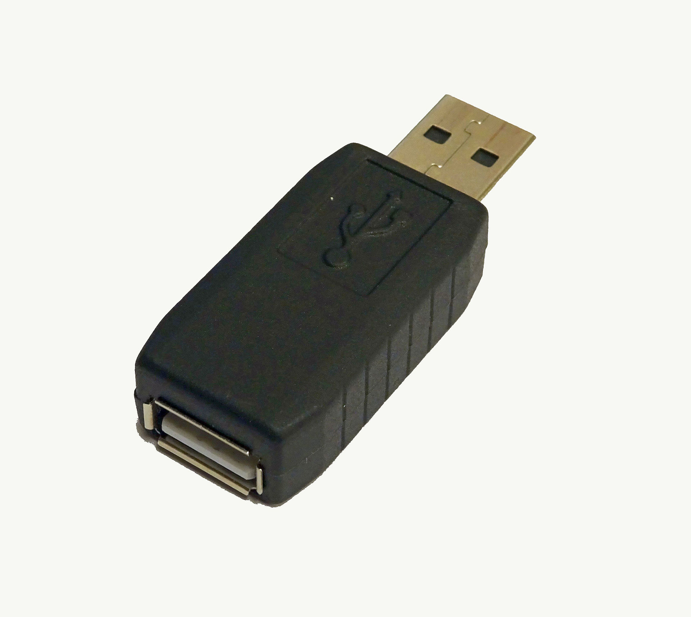

# Executing applications

- Remotely executing malicious programs designed to steal information, crack passwords, install backdoor, and so on.
- Next step after gaining access and elevating privileges.
- Programs that attackers install include
  - [Backdoor](./../07-malware/malware-overview.md#backdoor)s are designed to collect information and gain unauthorized access to the system
  - Crackers are designed to crack passwords
  - [Keylogger](#keylogger)s are designed to record keystrokes
  - [Spyware](#spyware) are designed to capture screenshots and send them to the attacker

## Keylogger

- Software or hardware device designed to
  1. record every keystroke on the target's keyboard
  2. logs them into a file
  3. sends them to a remote location
- Used for monitoring employee and children computer activity
- Allow gathering confidential information including emails and passwords.
- Two types: [hardware keylogger](#hardware-keylogger) and [software keylogger](#software-keylogger)

### Hardware keylogger

- 
- Look like USB drives and are designed to record keystrokes, which are stored on the device.
- Placed between a keyboard plug and USB socket
- Cannot be detected by antispyware or antivirus programs.
- Discoverable as they have to be physically placed onto a target's machine

#### Hardware keylogger types

- **PC/BIOS Embedded**
  - Modifying the BIOS level firmware to capture the keystrokes
- **Keylogger keyboard**
  - Attaching the hardware circuit with the keyboard cable connector
- **External keylogger**
  - Attaching the keylogger between a keyboard and computer.
  - E.g. PS/2 and USB Keylogger, Acoustic/CAM Keylogger, Bluetooth Keylogger, and Wi-Fi Keylogger.

### Software keylogger

- Installed on the target's machine
- Recorded keystrokes are
  - logged into a log file on the target's machine
  - then sent to the attacker using email protocols

#### Software keylogger types

- **Application keylogger**
  - Designed to observe the target's activity whenever type something.
  - It can record emails, passwords, messages, browsing activities, and so on.
- **Kernel keylogger**
  - Designed to exist on a kernel level and act as a keyboard device driver
  - Allows it to record everything that is typed on the keyboard
- **Rootkit keylogger**: forged Windows device driver which records keystrokes
- **Device driver keylogger**
  - Designed to replace the driver that has the keylogging functionality
  - Logs the keystrokes, and send the file to a remote location
- **Hypervisor-based keylogger**: designed to work within a malware hypervisor that is operating on the OS
- **Form grabbing based keylogger**: designed to record web browsing when the Submit event is triggered.

## Spyware

- Stealthy program designed to
  - record the target's interaction with the computer and Internet
  - send the recorded data to the attacker
- Able to take and send screenshots.
- Hidden when installed.

### Spyware types

- Desktop spyware
- Email spyware
- Internet spyware
- Child-monitoring spyware
- Screen-capturing spyware
- USB spyware
- Audio and video spyware
- Print spyware
- Telephone spyware
- GPS spyware
